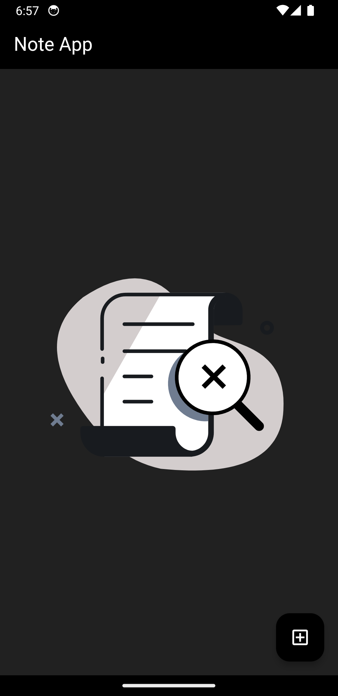
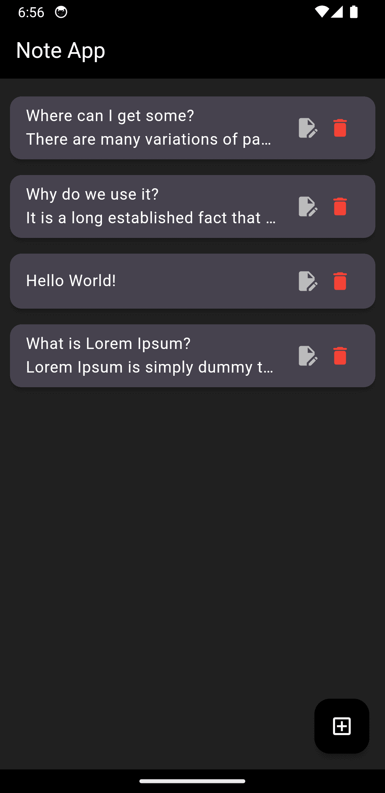
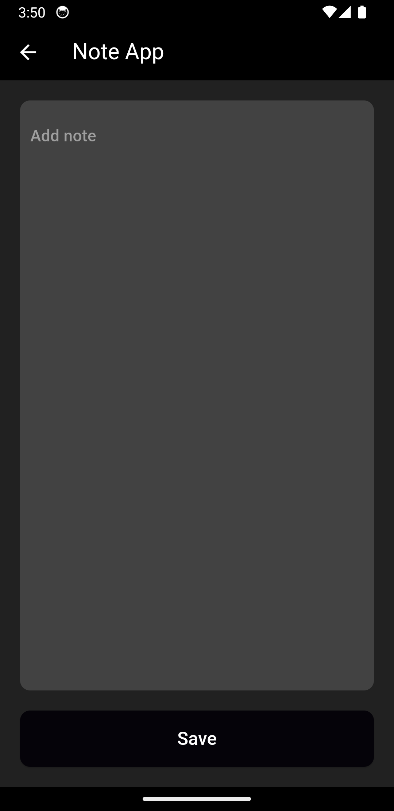

# Note App

A Flutter project for managing and organizing your notes.

## Getting Started

This project serves as a starting point for a Flutter application.

If this is your first Flutter project, consider checking out these resources:

- [Lab: Write your first Flutter app](https://docs.flutter.dev/get-started/codelab)
- [Cookbook: Useful Flutter samples](https://docs.flutter.dev/cookbook)

For detailed guidance on Flutter development, refer to the [online documentation](https://docs.flutter.dev/). It provides tutorials, samples, and a comprehensive API reference.

## Author

**MUZAMMIL**

Feel free to reach out for any questions or collaboration opportunities.

